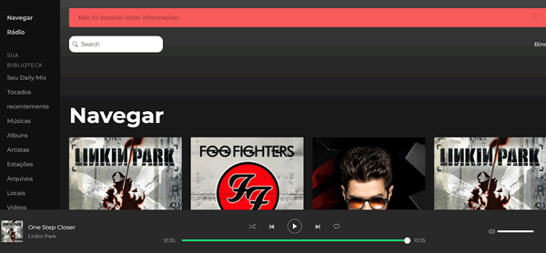

# PLAYER de músicas com ReactJS

Este foi o módulo 4 do curso de ReactJS do BootCamp da [RocketSeat](http://www.rocketseat.com.br)

O layout é parecido com o Spotify

Recursos que foram utilizados:

* Axios
* Redux
* Saga
* Styled Components
* ReactoTron

## Instalação

- git clone https://github.com/dbins/rocketseat-reactjs-modulo4
- npm install
- npm install -g json-server
- Ative o backend executando o comando json-server server.json -p 3001 -w -d 500
- npm run start